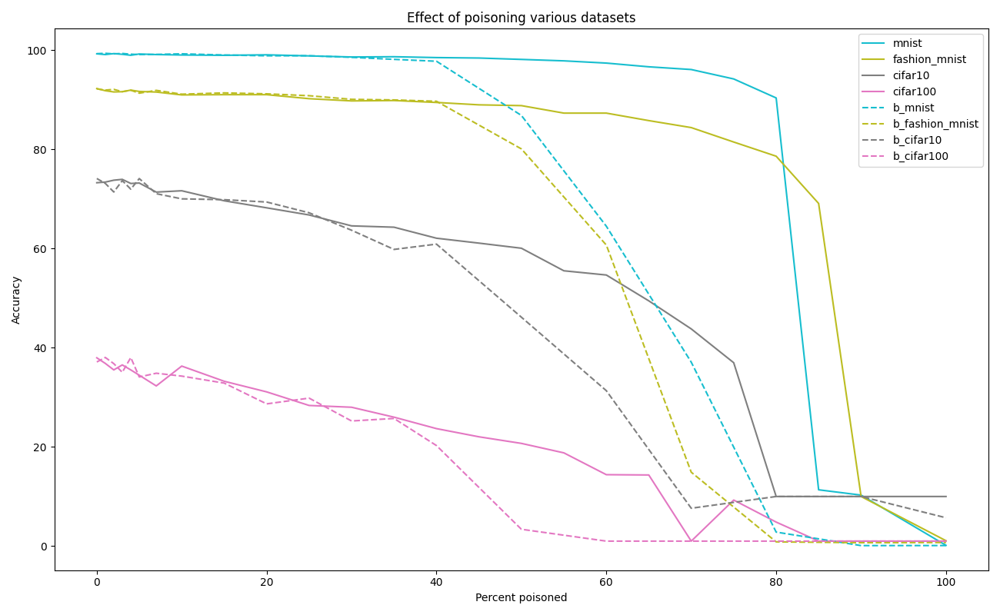
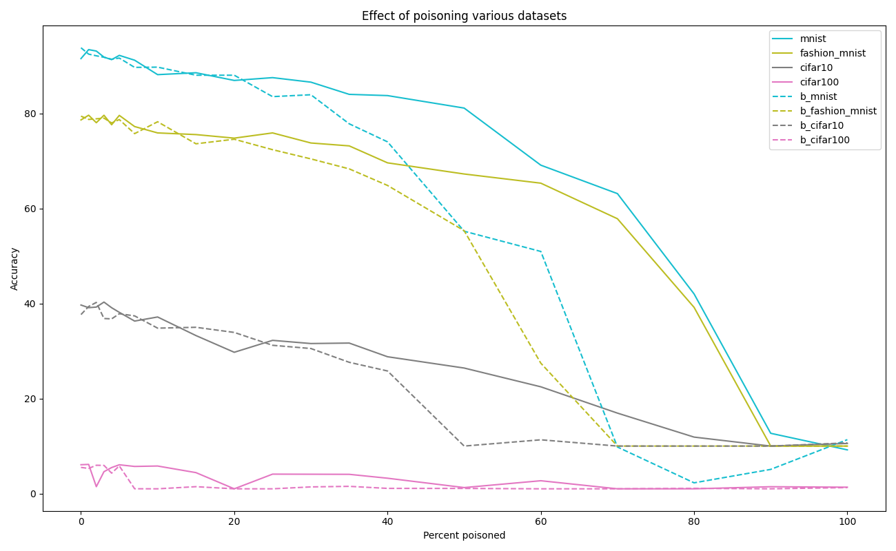

# dataset_poisoning
Analysis on how much dataset poisoning (mislabeled data) destroys a model, on default keras datasets: mnist, fashion_mnist, cifar10, cifar100.

A simple <100k parameter convolutional neural network is used for the evaluation of all models, as only relative performance is relevant.

Results show the surprising robustness of the network even when over half of the dataset is mislabelled. Evaluating the same on a dataset consisting of subsets of 1000 items from the original datasets the performance drops quicker, showing that more data with more errors can yield better results than less data with fewer errors.

#### Trained on the entire provided training dataset


#### Trained on a subset of 1000 items from the training dataset


## Requirements

I used python 3.8 and tensorflow-gpu 2.7 but any python3 and tf2 should work

`pip install -r req.txt`

## Training models

`train.py` trains models with different poison% per dataset, saving them in ./models/[b_]{dataset}/{perc_poison}/ (b_ for biased)

Normally, poisoning is done by picking any other class randomly. Biased mode simulates a systematic mislabelling where the wrong labels are always the first class (or second if the first class was the true label).

```
       USAGE: python train.py [flags]
flags:

  --batch_size: Batch size to use for training
    (default: '256')
    (an integer)
  --[no]biased: Have biased poisoning or perfectly random distribution.
    (default: 'false')
  --dataset: Dataset to use.
    (default: 'mnist')
  --dataset_size: How much of the dataset to use for training, 0 for all
    (default: '0')
    (an integer)
  --[no]overwrite: Overwrite models.
    (default: 'false')
  --percents: Percents to poison.
    (default: '0,1,2,3,4,5,7,10,15,20,25,30,35,40,50,60,70,80,90,100')
    (a comma separated list)
 ```
 
 ## Producing the graph
 
 `analyse.py` expects models organised as by `train.py`.
 
 ```
        USAGE: python analyse.py [flags]
flags:

  --[no]all: Use both random and biased poisoning.
    (default: 'false')
  --[no]biased: Use biased poisoning or perfectly random distribution.
    (default: 'false')
  --datasets: Datasets to use
    (default: 'mnist,fashion_mnist,cifar10,cifar100')
    (a comma separated list)
```

